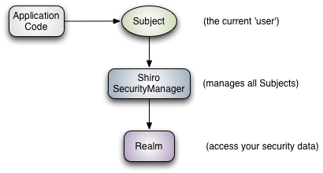
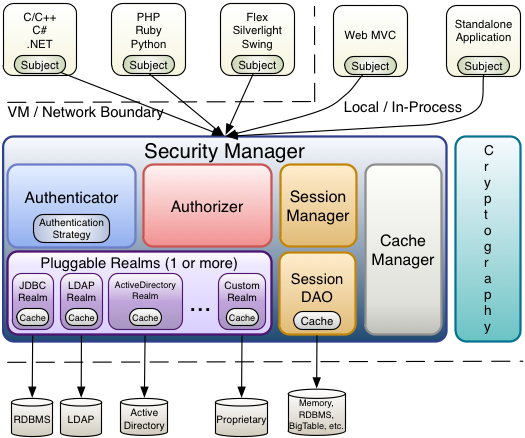

## 概述 ##
Apache [Shiro](http://shiro.apache.org/) 是Apache的一个子项目，跟[Spring Security](http://projects.spring.io/spring-security/)类似，用于Java项目集成认证授权功能，相比于Spring Security,Shiro更为简单易用，提供了认证、授权、加密、会话管理等。

## 核心 ##
Shiro主要有三个核心组件：

* Subject 是指当前用户操作 。
* SecurityManager 用来管理所有的Subject 。
* Realms 也就是我们需要自己实现的接口，用于进行认证和授权。

三个组件关系如下：


## 架构 ##
Shiro的架构图如下：


## 起步 ##
新建一个maven管理的webapp项目，引入依赖：
```code
<dependency>
	<groupId>org.apache.shiro</groupId>
	<artifactId>shiro-spring</artifactId>
</dependency>
```
因为我们要一起集成spring,所以通过引入shiro-spring来自动依赖shiro-core和shiro-web两个组件，如果你不需要，可以单独进行依赖管理。
