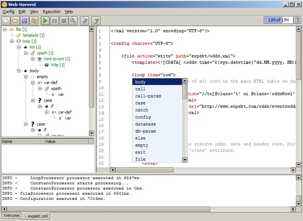

## 简介 ##
[WebHarvest](http://web-harvest.sourceforge.net/)是一款Java实现的页面数据提取工具，可以通过xpath,xquery等xml技术，精准高效灵活的对所关心的数据进行提取。

## 快速起步 ##
接下来，我们将通过获取一个网站页面来进行。
### 入口 ###
首先我们应该先实例化一个“小爬虫”，如下
``` java
String configFile = "xxx";//此处是爬虫爬取数据的规则文件，需用户编写。如："scraper-taobao.xml",可使用相对路径或绝对路径。
String scraperPath = "xxx";//此处配置爬取的根目录，如需生成本地数据文件，请指定系统绝对路径。如：D:/scraper,请注意路径分隔符。
ScraperConfiguration config = new ScraperConfiguration(configFile);
Scraper scraper = new Scraper(config, scraperPath);
```
### 配置 ###
``` java
scraper.addVariableToContext("param1", "value1");
scraper.addVariableToContext("param2", "value2");
```
如上，可将参数param1和param2传入scraper会话当中，从而在规则文件中动态获取参数。

### 启动 ###
``` java
scraper.execute();
```
爬虫爬取过程将会阻塞线程，所以性能不是很好。

### 处理数据 ###
``` java
Variable articles = (Variable) scraper.getContext().get("articles");
```
爬虫完毕后，会将爬到的数据保存到会话上下文中，我们可以通过获取规则文件中指定的参数，并转换为后台程序需要的数据，默认支持List，String，Integer等类型。

### 编写规则文件 ###
WebHarvest的规则文件是其核心，也是我们青睐它的原因之一，但目前编写该规则文件对程序员的门槛依然相对较高，虽然作者提供了IDE来简化编写难度，如下：


诚然，熟悉了语法之后，我们就可以通过徒手编写规则来完成了，以下是需要了解的关键技术：

* xpath 一门可以在XML文档快速定位和查找结点的语言。
* regex 业界通用的强大到无敌的正则表达式。
* xquery 可以将XML作为SQL容器的语言。

更对用法请参考[官方文档](http://web-harvest.sourceforge.net/manual.php)